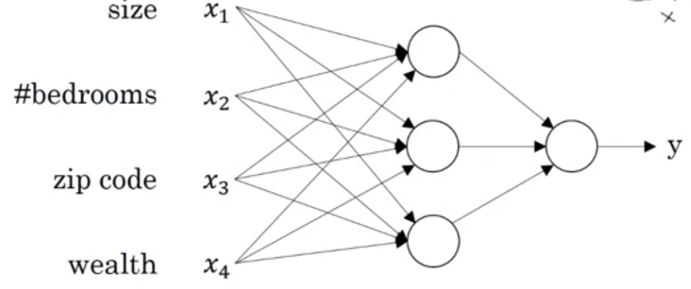
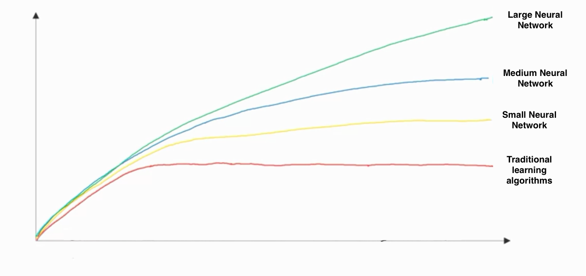
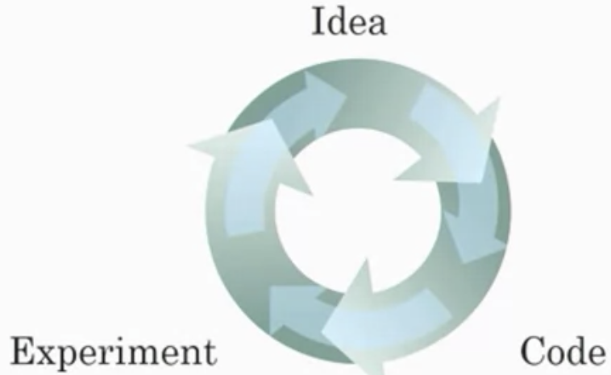

# Neural Network

* A neuron implements an activation function
* ReLU function $\rightarrow$ rectified linear unit (take max with 0) often used
* Stack neurons together to create network of multiple input features
* Provide input and output only (supervised learning)

* Given enough training data, very accurate in mapping an input to an output

# Supervised learning with neural networks

* Structured data $\rightarrow$ databases of data with organization
* Unstructured data $\rightarrow$ data is not well-defined (e.g. images, audio, text)

# Deep learning progress

  

* Neural network progress always increases with scale of data whereas traditional algorithms plateau, esp. with **large** NNs
* Scale drives deep learning progress
* $m$ denotes training set size

