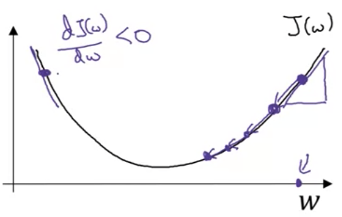
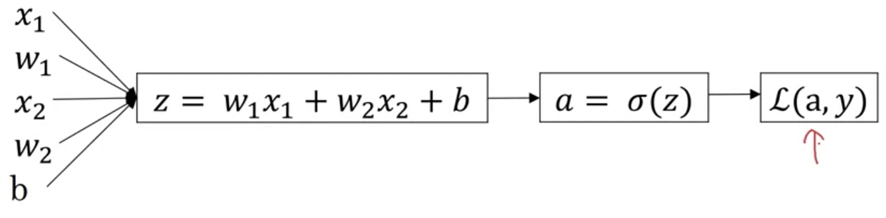

# Binary Classification

* Output is either 0 or 1
* Notation
  * Single training example $\rightarrow$ $(x,y)$
  * Feature vector $x\in \mathbb{R}^{n_x}$ and output $y\in \{0,1\}$ where $n_x$ is number of features
  * Have $m$ training examples $(x^{(1)},y^{(1)}),\ldots,(x^{(m)},y^{(m)})$
  * The matrix $X$ is defined as $X=\begin{bmatrix}|&|&&|\\x^{(1)}&x^{(2)}&\cdots&x^{(m)}\\|&|&&|\end{bmatrix}$, and is $n_x\times m$ in dimension (`X.shape=(nx,m)`)
  * Define $Y=\begin{bmatrix}y^{(1)}&\cdots&y^{(m)}\end{bmatrix}$ where `Y.shape=(1,m)`

# Logistic Regression

* Used in binary classification problems
* Given $x$, want $\hat{y}=P(y=1|x)$ where $x\in \mathbb{R}^{n_x}$ with $0\leq \hat{y}\leq 1$
* Parameters are $w\in \in \mathbb{R}^{n_x},b\in \mathbb{R}$

  

* Output is then $\hat{y}=\sigma(w^T+b)$
  * $\sigma(z)=\frac{1}{1+e^{-z}}$
* $w$ is $theta_1\to \theta_{n_x}$ and $b=\theta_0$ for notational correspondence

# Logistic Regression Cost Function

* Ultimately want $\hat{y}^{(i)}\approx y^{(i)}$
* Define loss $\mathcal{L}(\hat{y},y)=-(y\log(\hat{y})+(1-y)\log(1-\hat{y}))$ that is convex, for **single training example**
  * If $y=1$, $\mathcal{L}=-\log(\hat{y}$ $\rightarrow$ want $\hat{y}$ large ($\approx 1$)
  * If $y=0$, $\mathcal{L}=-\log(1-\hat{y})$, so want $\hat{y}$ small ($\approx 0$)
* Cost function tells how model does on **entire training set**
  * $J(w,b)=-\frac{1}{m}\sum_{i=1}^m\mathcal{L}(\hat{y}^{(i)},y^{(i)})$

# Gradient Descent

* Method to find $w,b$ for $\mathrm{min}(J(w,b))$, which is convex
  * No local minima

Repeat {
$$
w:=w-\alpha \frac{dJ(w)}{dw}\\
b:=b-\alpha\frac{dJ(w,b)}{db}
$$
}

In code, call deriv. `dw`.

* Signs work out, so subtraction is used (want to move **opposite** to direction of function in order to converge to minima)

  

* Would use partial derivative if $\mathrm{arglen}(J)>1$

# Computation Graphs

* Example: Let $J(a,b,c)=3(a+bc)$
  * Then, $u=bc$, and $v=a+u$, so $J=3v$
* Drawing the computation graph


* Derivatives are a right $\rightarrow$ left computation, and in this case it is left $\rightarrow$ right

# Derivatives with Computation Graphs

* Derivative of last step of graph is one step backwards in **backpropagation**
* Can take derivative of $J$ with respect to any variable $\rightarrow$ chain rule
  * E.g. $\frac{dJ}{dv}\frac{dv}{da}=\frac{dJ}{da}$
* Many computations involve derivative of final variable (i.e. $J$) wrt arbitrary intermediate variable
* Convention `dvar` means derivative of final output variable wrt some intermediate quantity

# Logistic Regression Gradient Descent

Recall
$$
\boxed{
\begin{array}{l}
z=w^{T} x+b \\
\hat{y}=a=\sigma(z) \\
\mathcal{L}(a, y)=-(y \log (a)+(1-y) \log (1-a))\\
\frac{dL}{dz}=a-y
\end{array}}
$$

  

* First step $da=\frac{d\mathcal{L}(a,y)}{da}$ in backpropagation
* Can show $dz=\frac{d\mathcal{L}}{dz}$

# Gradient descent on $m$ examples

* Partial derivative of cost function is 

$$
\frac{\partial}{\partial w_i} J(w, b)=\frac{1}{m} \sum_{i=1}^{m} \frac{\partial}{\partial w_{i}} \mathcal{L}\left(a^{(i)}, y^{(i)}\right)
$$

Initially, $J=0,dw_1=0,dw_2=0,db=0$.

For $i=1\to m$
* $z^{(i)}=w^Tx^{(i)}+b$
* $a^{(i)}=\sigma(z^{(i)})$
* $J+= \left[y^{(i)}\log a^{(i)}+(1-y^{(i)})\log(1-a^{(i)})\right]$
* $dz^{(i)}=a^{(i)}-y^{(i)}$
* $dw_1+=x_1^{(i)}dz^{(i)}$
* $dw_2+=x_2^{(i)}dz^{(i)}$
* $db+=dz^{(i)}$

Finally, $J/=m;dw_1/=m;dw_2/=m;db/=m$. $dw_1=\frac{\partial J}{\partial w_1}$ is calculated as a vector.

$$
w_1:=w_1-\alpha\;dw_1\\
w_2:=w_2-\alpha\;dw_2\\
b:=b-\alpha\; db
$$

Requires multiple iterations. Need to implement vectorization.

# Vectorization

* Eliminates for loops

Need to calculate $z=w^Tx+b$:

```python
z = np.dot(w,x) + b
```

`numpy` vectorization takes advantage of parallelism on CPUs, does not use GPU.

## Vectorization of logistic regression

Use formula

$$
\begin{bmatrix}z^{(1)}&\cdots &z^{(m)}\end{bmatrix}
=w^TX+\begin{bmatrix}b&\cdots &b\end{bmatrix}
$$

```python
z = np.dot(w.T,X) + b
```

$b$ is implicitly **broadcasted** to a row vector of $1\times m$.

## Vectorizing Logistic Regression Gradient Output

$$
dz=A-Y=\begin{bmatrix}a^{(1)}-y^{(1)}&\cdots& a^{(m)}-y^{(m)}\\\end{bmatrix}
$$

$$
db=\frac{1}{m}\sum_{i=1}^m dz^{(i)}
$$

Same as `1/m*np.sum(dz)`. Then, $dw=\frac{1}{m}Xdz^T$, so `dw = 1/m*np.dot(X,dz.T)`.

Complete vectorized implementation:

```python
Z = np.dot(w.T,X) + b
A = sigmoid(Z)
dZ = A - Y
dw = 1/m*np.dot(X,dz.T)
db = 1/m*np.sum(dz)

w = w-alpha*dw
b = b-alpha*db
```

Need a for loop for multiple iterations.

# Broadcasting in Python

* Implicit elementwise operations on vectorial data (`ndarray`) allows interchange with real numbers (i.e. `someMatrix + 5`)

To sum columns, use `A.sum(axis=0)` for some matrix $A$.

**Horizontal axis is 1, vertical is 0**.

Complete example:

```python
cal = A.sum(axis=0) # columnwise summing, is 3x4 for example
# percentages of each value in matrix out of column total
percentage = 100*A/cal.reshape(1,4)
```

* Broadcasting also works automatically to reshape or duplicate rows/columns of vectors when adding to others
  * Example if operating on $(m,n)$ matrix with some vector $(1,n)$ or $(1,m)$, will cast to $(m,n)$ automatically
* MATLAB/Octave `bsxfun` replicates advanced broadcasting

# NumPy vectors

* A $n$-dimensional array has structure tuple `(n,)` $\rightarrow$ does not behave as a vector
* Called **rank 1 array** $\rightarrow$ do not use
* Use explicit dimensions when initializing `ndarray`s
* Can do `assert(a.shape == (n,1))` to check and reshape if necessary

# Explanation of Logistic Cost Function

* Interpreting $\hat{y}=\sigma(w^Tx+b)$
  * If $y=1$, $P(y|x)=\hat{y}$
  * If $y=0$, $p(y|x)=1-\hat{y}$
* Is summarized into $p(y|x)=\hat{y}^y(1-\hat{y})^{(1-y)}$
* Therefore $\log(p(y|x))=y\log \hat{y}+(1-y)\log(1-\hat{y})=-\mathcal{L}(\hat{y},y)$
* Probabilities for all labels is product $\log p(\text{labels in training set})=\log \prod_{i=1}^m p(y^{(i)}|x^{(i)})$
* Same as $\log p(\cdots)=\sum_{i=1}^m \log p(y^{(i)}|x^{(i)})=-\sum_{i=1}^m \mathcal{L}(\hat{y},y)$
  * Maximum likelihood estimate maximizes this

Cost, obj. to minimize, is

$$
J(w,b)=\frac{1}{m}\sum_{i=1}^m\mathcal{L}(\hat{y},y)
$$

No negative sign as want to minimize cost, not maximize likelihood, and scale down. Therefore we are carrying out maximum likelihood estimation when minimizing cost.