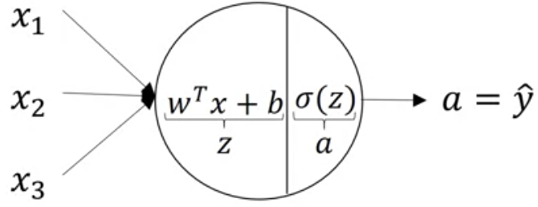
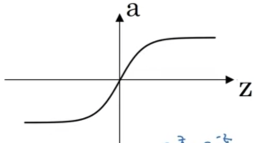
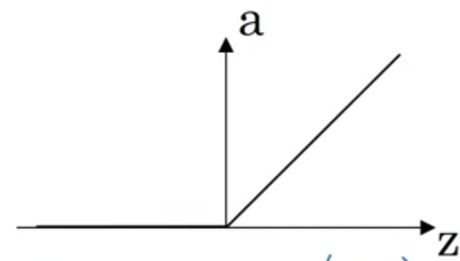
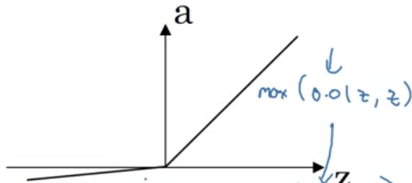

# Overview

* Superscript $[l]$ refers to $l$-th layer
* Right-to-left propagation allows for computing derivative at each step
 
# Neural Network Representation

* Hidden layers are in between output and input layers
  * True values not observed, only I/O
* Notation $\rightarrow$ $a^{[0]}=x$, $a^{[1]}$ represents the activation unit **vectors** of dimension being number of nodes in layer
  * Also contain $w^{[l]}$ and $b^{[l]}$
* Counting layers $\rightarrow$ **input** layer not counted, so indexed by 0

# Computing Neural Network Output

  

* Single node takes in all elements of a feature
* Notation $\rightarrow$ $a_i^{(l)}$ is the $i$th node of the $l$th layer
* Want to vectorize $z_i^{[l]}=w_i^{[l]T}x+b_i^{[l]},a_i^{[l]}=\sigma(z_i^{[l]})$
* $w_i^{[l]T}$ is a row-vector, so results in a matrix when vectorized, with the row vectors stacked. Then just multiply by $x$, i.e. vector 
 
$$z^{[l]}=W^{[l]}x^{[l]}+b^{[l]}$$

* Then, $a^{[l]}=\sigma(z^{[l]})$

# Vectorizing across multiple examples

$$
x^{(i)}\rightarrow a^{[l](i)}=\hat{y}^{(i)}
$$

For $i\in [1,m]$, this accounts for $m$ training examples.

$$
\begin{array}{l}
\text { for } i=1 \text { to } m: \\
z^{[1](i)}=W^{[1]} x^{(i)}+b^{[1]} \\
a^{[1](i)}=\sigma\left(z^{[1](i)}\right) \\
z^{[2](i)}=W^{[2]} a^{[1](i)}+b^{[2]} \\
a^{[2](i)}=\sigma\left(z^{[2](i)}\right)
\end{array}
$$

Vectorize:

$$
Z^{[l]}=W^{[l]}X+b^{[l]}\\
A^{[l]}=\sigma(Z^{[l]})
$$

Closer look:

$$
z^{[l]}=\left[z^{[l](1)}\;z^{[l]2)}\;\cdots \; z^{[l](m)}\right]
$$

# Activation Functions

* $\tanh(z)$ is better than $\sigma(z)$ and has range $[-1,1]$
  * Formula $\rightarrow$ $a=\tanh(z)=\frac{e^z-e^{-z}}{e^z+e^{-z}}$
  * Represent of $g^{[l]}(z^{[l]})$

  

* Formula for ReLU function is $a=\mathrm{max}(0,z)\implies \frac{d}{dz}a=\mathrm{max}(0,1)$, is a good default choice
  * Is faster than $\tanh$ and $\sigma$
    * Less effect of slope approaching 0, since it is rectified

  

* Only use sigmoid for binary, always use $\tanh$, but ReLU is most commonly used, or the leaky ReLU ($a=\mathrm{max}(0.001z,z)$)

  

# Reason for nonlinear activation functions

* Say $g(z)=z$, so an identity activation function
* A linear function of input is the output, which results in no point for hidden layers
  * The output layer can use a linear function to give output $\in \mathbb{R}$

# Derivatives of Activation Functions

* Sigmoid function
  * $g'(z)=\frac{d}{dz}\frac{1}{1+e^{-z}}(1-\frac{1}{1+e^{-z}})=g(z)(1-g(z))$
* Tanh function
  * $g'(z)=\frac{d}{dz}g(z)=1-(\tanh(z))^2$
* ReLU function
  * $g(z)=\mathrm{max}(0,z)$
  * $g'(z)=\begin{cases}0,z<0\\1,z\geq 0\\\mathrm{DNE},z=0\end{cases}$
* Leaky ReLU
  * $g(z)=\mathrm{max}(0.01z,z)$
  * $g'(z)=\begin{cases}0.01,z<0\\1,z>0\\\mathrm{DNE},z=0\end{cases}$

# Gradient Descent for Neural Networks