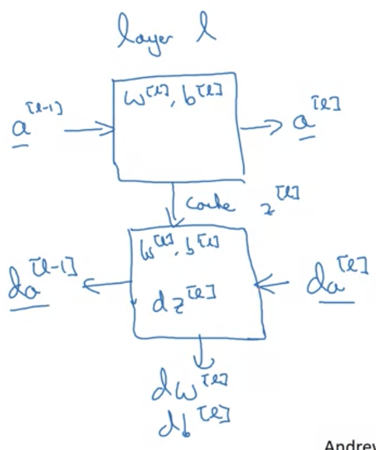

# Deep L-layer neural network

- Logistic regression is shallow model, and a deeper network has more hidden layers
- Notation
  - $L$ - number of layers in network
  - $n^{[l]}$ - number of units in layer $l$
    - $n^{[0]}=n_x$
  - $a^{[l]}=g^{[l]}(z^{[l]})$
    - $a^{[0]}=x,a^{[L]}=\hat{y}$

# Forward propagation

- Steps
  - $z^{[l]}=w^{[l]}a^{[l-1]}+b^{[l]}$
  - $a^{[l]}=g^{[l]}(z^{[l]})$
- Vectorized across $m$ examples
  - $Z^{[l]}=W^{[l]}A^{[l-1]}+b^{[l]}$ where $X=A^{[0]}$
  - $Z,A,X$ are stacked columnwise, i.e. $Z^{[1](1)},\ldots,Z^{[L](m)}$

# Matrix Dimension Debugging

- Forward propagation step

$$
\begin{aligned}
z^{[l]}&=W^{[l]}a^{[l-1]}+b^{[l]}\\
(n^{[l]},1)&=(n^{[l]},n^{[l-1]})(n^{[l-1]},1)+(n^{[l]},1)
\end{aligned}
$$

- If vectorized, must modify

$$
\begin{aligned}
Z^{[l]}&=W^{[l]}A^{[l-1]}+b^{[l]}\\
(n^{[l]},m)&=(n^{[l]},n^{[l-1]})(n^{[l-1]},m)+\underbrace{(n^{[l]},1)}_{\text{broadcasted}}
\end{aligned}
$$

# Why deep representations

- Example of face $\rightarrow$ composition of simple to complex
  - First layer finds edges
  - Second layer puts edges together to compose face parts
  - Third could detect faces
- Circuit theory and deep learning
  - Functions are easier to calculate in a small L-layer deep NN, but shallow NN needs much more hidden layers
  - Less layers, need more hidden units

# Building blocks of deep neural networks

- Forward prop.: input $a^{[l-1]}$ and output $a^{[l]}$ 
  - Also cache $z^{[l]}$ for backprop usage
- Backpropagation
  - Input $da^{[l]}$ and $z^{[l]}$ and output $da^{[l-1]}$

  

# Forward and backward propagation

- Forward propagation for layer $l$
  - Input $a^{[l-1]}$
  - Output $a^{[l]}$, cache $z^{[l]},w^{[l]},b^{[l]}$
- Backward propagation for layer $l$
  - Input $da^{[l]}$
  - Output $da^{[l]},dW^{[l]},db^{[l]}$
  - Initialize $da^{[l]}=-\frac{y}{a}+\frac{1-y}{1-a}$

# Parameters vs Hyperparameters

- Hyperparameters - learning rate $\alpha$, num. iterations, $L$, num. of hidden units, choice of activation function
- Control the parameters $W^{[1]}, b^{[1]}, W^{[2]}, b^{[2]}, W^{[3]}, b^{[3]} \ldots$