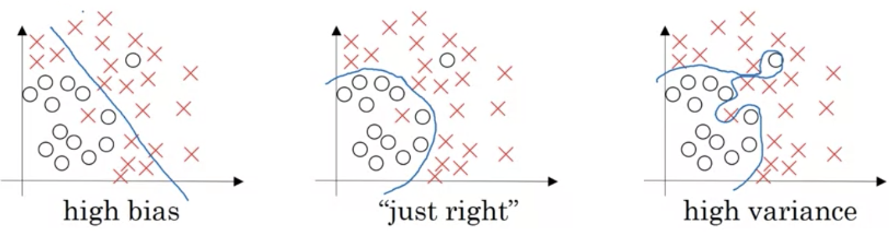
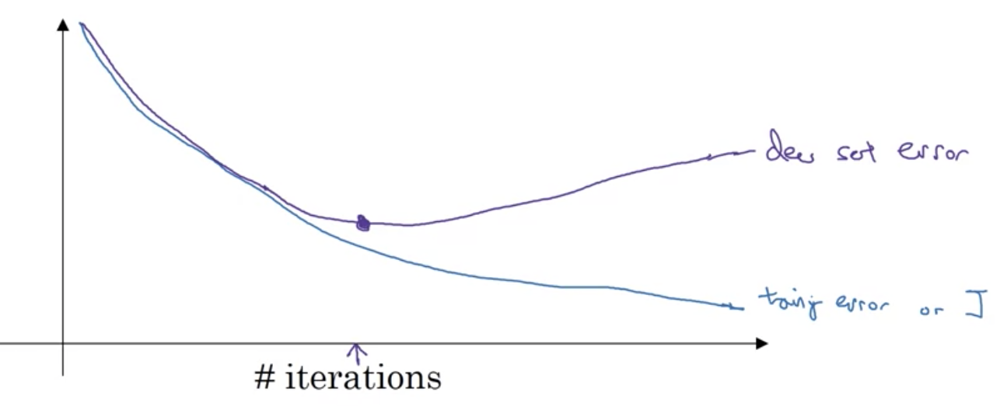
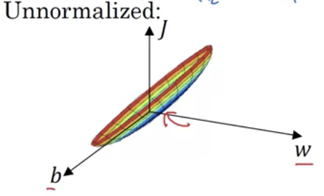
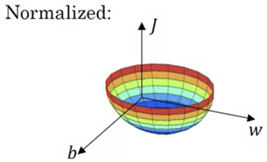

# Train/test/dev sets

- Divide original data into 3 different sets
- Use dev set to evaluate various models
- Use final model on test set for unbiased estimate
- For large $m$, dev and test sets become smaller
  - E.g. 0.98, 0.01, 0.01 distribution
- Mismatched train/test distribution
  - Source/quality of training set is different than dev/test sets
  - Ensure dev/test sets come from same distribution
- Can work without a test set $\rightarrow$ unbiased estimate of chosen network

# Bias/variance

  

- High bias involves underfitting
  - Generalizes well but has high error
- High variance involves overfitting
  - Does not generalize well from train to dev set

# Basic recipe for ML

- If high bias
  - Bigger network
  - Train longer
  - Try different NN architectures
- If high variance
  - More data
  - Regularization
  - NN architecture change
- Bias-variance tradeoff
  - Bigger network reduces bias without increasing variance, or more date $\rightarrow$ less of tradeoff
  - Use regularization

# Regularization

- Logistic regression $\rightarrow$ find $\underset{w,b}{\mathrm{min}}J(w,b)$ with $w\in \mathbb{R}^{n_x},b\in \mathbb{R}$
  
$$
J(w,b)=\frac{1}{m}\sum_{i=1}^m\mathcal{L}(\hat{y}^{(i)},y^{(i)})+\frac{\lambda}{2m}||w||^2
$$

where the $L_2$ (Euclidean) norm is $||w||_2^2=\sum
_{j=1}^{n_x}w_j^2=w^Tw$. Can omit reg. term for $b$.

$L_1$ regularization: $\frac{\lambda}{2m}\sum_{i=1}^{n_x}|w|=\frac{\lambda}{2m}||w||_1$. $w$ is sparse, i.e. has lots of zeros. Less often used.

- For multiple layers, use Frobenius norm

$$
||w^{[l]}||_F^2=\sum_{i=1}^{n^{[l]}}\sum_{j=1}^{n^{[l-1]}}(w_{i,j}^{[l]})^2
$$

- Implementing gradient descent with regularization
- $dw^{[l]}=\mathrm{backprop}+\frac{\lambda}{m}w^{[l]}$, then perform parameter update
- Called weight decay as this is equivalent to a coefficient $1-\frac{\alpha\lambda}{m}$

# Why regularization reduces overfitting

- A high $\lambda$ reduces weights so reduces impact of hidden units $\rightarrow$ higher bias
- Leads to small range of $z$ in tanh function, so approx. linear
  - So every layer $\approx$ linear

# Dropout Regularization

- Give each node 0.5 chance of removal
  - Run simulation, and "kill" node connections from those chosen nodes $\rightarrow$ reduced network
- Inverted dropout
  - Check `d3 = np.random.randn(*a3.shape) < keep_prob`
  - Set `a3 = np.multiply(a3,d3)` to zero out nodes
  - Divide `a3` by `keep_prob` to maintain expected value $z$
    - `a3 /= keep_prob`
- Cannot rely on any one feature, so spread out weights
  - Shrinks the squared norm of weights
  - Varying `keep_prob` by layer
    - Higher value for layers less prone to overfitting
    - More hyperparameters
- Cost function $J$ not well-defined anymore
  - Plot cost without dropout prior to usage

# Other Regularization Methods

- Data augmentation
  - Use existing training examples and permute to create more 
  - Rotation, flip, translation, etc.
  - Distortions and rotations on digits/characters

  

- Early stopping
  - Plot dev set error along with cost over iteratoins
  - Cut off training halfway so only a midsize $||w||^2_F$
  - However, stops optimization simulataneously with not overfitting

# Normalizing Inputs

  

- Subtract mean $\mu=\frac{1}{m}\sum_{i=1}^m x^{(i)}$ and divide by std. dev $\sigma^2=\frac{1}{m}\sum_{i=1}^m x^{(i)2}**2$ where both are vectors
  - $x:=x-\mu$ and $x /= \sigma$
- Normalize test and training data with $\mu$ and $\sigma^2$ from training data, not individually

# Vanishing/exploding gradients

- If there is a deep network with $L$ layers and all biases $b=0$
  - If weight matrix $w$ values > 1, then $\hat{y}$ exponentially increases, else if $\lt$ 1, it exponentially decreases
  - Thus gradients increase or decrease as well

# Weight initialization for deep networks

- Can set $\mathrm{Var}(w)=\frac{1}{n}$ where $n$ is input feature number
- In practice, $W^{[L]}=$`np.random.randn(shape)*np.sqrt(2/n_prev)` for ReLU or use $\sqrt{\frac{1}{n^{[l-1]}}}$ for tanh in place of `np.sqrt`
  - Can add hyperparameters

# Numerical Approximation of Gradients

- Use the limit definition of the derivative
  - If $f(\theta)=\theta^3$, then $\frac{d}{d\theta}f(\theta)\approx\frac{f(\theta+\epsilon)-f(\theta-\epsilon))}{2\epsilon}$
  - Error is on order $O(\epsilon^2)$

# Gradient Checking

- Reshape $W^{[1]}, b^{[1]}, \ldots, W^{[L]}, b^{[L]}$ into large vector $\theta$
  - Then, $J(\theta)$
- Reshape $dW^{[1]}, db^{[1]}, \ldots, dW^{[L]}, db^{[L]}$ into $d\theta$
- Check if $d\theta$ is slope of $\theta$
- Compute $d\theta_\mathrm{approx}^{[i]}$ for each element in both matrices using $\frac{f(\theta+\epsilon)-f(\theta-\epsilon))}{2\epsilon}$
- Use $\frac{||d\theta_\mathrm{approx}-d\theta||}{||d\theta_\mathrm{approx}||+||d\theta||}$
  - Accurate if $\epsilon \approx 10^{-7}$
- Only use in debugging
- Look at components of $d\theta$ to identify bug
- Must account for regularization term
- Does not work with dropout
- Run at random initialization and after some training
  - Could work initially and become inaccurate
