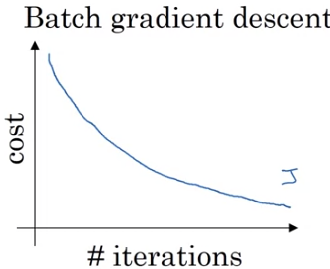
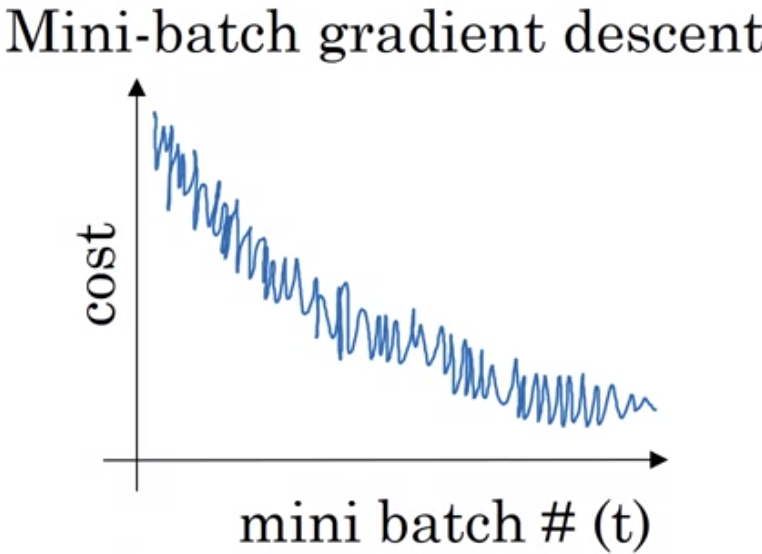
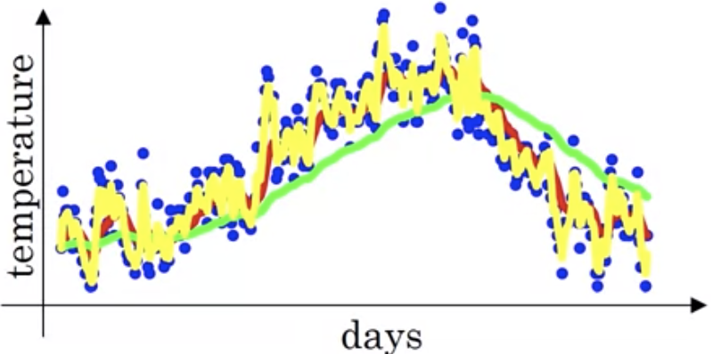
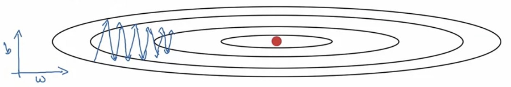

# Mini-batch gradient descent

- Vectorization allows for compute on $m$ examples
    - Let $X=[x^{(1)},\ldots, x^{(1000)}|x^{(1001)},\ldots,x^{(2000)}]$ be split into $x^{\{1\}}$ and $x^{\{2\}}$ for example, these are the batches
    - Up to 5000 batches
    - $Y$ can also be divided this way into minibatches
    - $X^{\{j\}}$ has dimension $(n_x,t)$ and $Y^{\{j\}}$ is of $(1,t)$
        - $t$ is the batch size
- Use vectorization to process
    - For each minibatch, perform propagation step using each minibatch
    - Can then calculate cost and perform backprop
- Epoch is a single pass through training set

# Understanding mini-batch gradient descent

- Batch gradient descent
  - Must decrease on every iteration

  

- Mini-batch gradient descent
    - Train as if new dataset on each batch
  
  

- Choosing mini-batch size
  - If size = $m$, then batch gradient descent
  - If size = 1, then stochastic gradient descent with each example as a minibatch
    - Lose vectorization benefit
  - In practice, size $\in(1,m)$
- For small training sets use batch GD
- For typical use, can do $m=64,128,256,512,\ldots$ or powers of 2

# Exponentially weighted averages

- Initialize $v_0=0$, and every following time unit $v_1=0.9V_0+0.1\theta_0$ where $\theta$ is a set of weights
  - Is an exponentially weighted moving average of temperature
  - General 

$$v_t=\beta v_{t-1}+(1-\beta)\theta_t$$

  - $v_t$ is approx. average over $\frac{1}{1-\beta}$ time units
  - Shorter window $\rightarrow$ more noise in average plot, more susceptible to minute change

  

- Implementation
  - Re-update $v_\theta$ with weighted average on each iteration of loop
  - Takes little memory, overwrite the variable

# Bias correction in Exponentially Weighted Averages

- With this approach, $v_t$ will be much less than the weight values durind update
- To correct, divide by $1-\beta^t$ on each step to normalize and remove bias

# Gradient Descent with Momentum

- Compute EWA of gradients to use in parameter update
- On each iteration $t$
  - Compute $dW$, $db$ on mini-batch
  - $v_{dw}=\beta dW+(1-\beta)dW$ and likewise for $db$
- Update: $w:=w-\alpha {dW}$ and same for $b$
  - $v_{dW}$ is velocity and $dW$ is acceleration, whereas $\beta$ is like friction
- Takes faster steps towards global minimum
  - Damps oscillations
- Hyperparameters
  - $\alpha,\beta=0.9$ (typical)

# RMSprop

  

- Root mean squared propagation
- On iteration $t$
  - Calculate $dW$, $db$ on current minibatch
  - $S_{dW}=\beta S_{dW}+(1-\beta)dW^2$, elementwise squaring
  - $S_{dn}=\beta_2 S_{db}+(1-\beta_2)db^2$
  - Keeps an exponentially weighted average of square of derivatives
  - $W:=W-\alpha \frac{dW}{\sqrt{s_{dW}+\epsilon}}$
  - $b:=\alpha \frac{db}{\sqrt{s_{db}+\epsilon}}$
    - From image, want to damp out oscillations on $b$ axis
- $\epsilon\approx 10^{-8}$ prevents undefined error for numerical stability

# Adam Optimization Algorithm