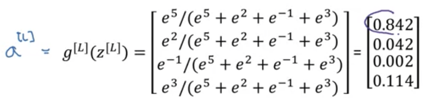

# Tuning Process

- Choose parameter combinations (points) at random in a space
- 2 parameters - grid
- 3 parameters - cube
- Coarse to fine sampling
  - Sample densely within a region with better parameter combinations
  - Coarse sample of all combinations

# Scale to pick hyperparameters

- Use a log scale to range $\alpha$ for example
  - Set $r\in [a.b]$
  - Then $\alpha\in [10^a,10^b]$ satisfying the range
- Hyperparameters for exponentially weighted averages
  - Set $r\in [a,b]$
  - $1-\beta=10^r$
  - $\beta=1-10^r$
  - Sampling regime important, as small changes change the values in Adam optimization largely

# Pandas vs. Caviar

- Babysitting one model
  - Adjust hyperparameters one day at a time while observing performance
  - Can't train many models at once
  - Panda approach
- Train many models in parameter with different hyperparameter settings
  - Caviar approach

# Normalizing Activations

- $\mu=\frac{1}{M}\sum_i x^{(i)}$
- $x=x-\mu$
- $\sigma^2=\frac{1}{m}\sum_i x^{2(i)}$
- $x=x/\sigma$
- Makes contours more circular, beneficial for gradient descent
- Batch normalization $\rightarrow$ normalize $a^{[2]}$ to train $w^{[3]},b^{[3]}$ faster

  

- Normalize the values of $z^{[2]}$ instead of $a^{[2]}$
- Implementing Batch Norm
  - Given intermediate NN values $z^{(1)},\ldots,z^{(i)}$
    - $\mu=\frac{1}{M}\sum_i x^{(i)}$
    - $\sigma^2=\frac{1}{m}\sum_i (z_i-\mu)^2$
    - $z_\mathrm{norm}^{(i)}=\frac{z^{(i)}-\mu}{\sqrt{\sigma^2+\epsilon}}$
  - $\bar{z}^{(i)}=\gamma z_\mathrm{norm}^{(i)} + \beta$
    - These are hyperparameters which allow for adjustment of $z_\mathrm{norm}^{(i)}$
  - Use $\bar{z}^{[l](i)}$ instead of ${z}^{[l](i)}$

# Fitting Batch Norm into network

- Example computation for first layer

$$
x \overset{w^{[1]},b^{[1]}}{\rightarrow} z^{[1]} \overset{\beta^{[1]},\gamma^{[1]}}{\rightarrow} \bar{z}^{[1]} {\rightarrow} a^{[1]}=g^{[1]}(\bar{z}^{[1]})
$$

- Repeat for each layer
- Parameters are $W^{[k]},b^{[k]},\beta^{[k]},\gamma^{[k]}$ for $k\in [1,L]$ are the parameters
- Working with mini-batches
  - Conduct batch norm for each minibatch (i.e. starting with $X^{\{1\}}$)
  - Batch norm only uses examples from the current minibatch
- $b^{[l]}$ gets subtracted out in the mean subtraction step, so **eliminate this parameter, is redundant**
  - Simply remove from the subtraction
- Implementing gradient descent
  - For $t\in [1,\mathrm{numMiniBatch}]$
    - Compute forward prop on $X^{\{t\}}$
      - In each hidden layer, use batch norm
    - Use backprop to calculate $dw^{[l]},d\beta^{[l]},d\gamma^{[l]}$ and update parameters

# Batch norm reasoning

- Conducts input normalization but for hidden units
- Makes deeper weights robust to changes in weights of earlier layers
- Learning on shifting input distribution $\rightarrow$ covariant shift
  - If $X$ distribution changes, must retrain for $X\rightarrow Y$ mapping, so values input to a hidden layer change
  - Batch norm reduces this effect, layers are more independent
- Batch norm as regularization
  - Each minibatch scaled by mean/variance of the examples in it
  - Adds noise to $z^{[l]}$, so adds noise to hidden layer activations similar to dropout
  - Has slight regularization effect, but with a larger minibatch size this is reduced

# Batch Norm at Test Time

- Need to estimate $\mu,\sigma^2$ at test time using weighted average across minibatches
- Calculate $\mu^{\{1\}{l}},\ldots,\mu^{\{n\}{l}},$ using a moving average, same for $\sigma^2$

# Softmax regression

- If there are multiple classes (e.g. Chick, Dog, Cat with classes 3, 2, 1, and 0 if none)
  - Indexes are $i\in [0,C-1]$ with $C$ classes

  

- Output is a 4-dim layer, each node contains probability $P(\mathrm{class}|x)$
  - Sum must be 1
- Softmax output layer generates these outputs
  - Is an activation function
- Compute a temp. var $t=e^{z^{[L]}}$ elementwise of dim (4,1)
  - $a^{[L]}=\frac{e^{z^{[L]}}}{\sum_{i=1}^4 t_i}$ such that $a_i^{[L]}=\frac{t_i}{\sum_{i=1}^4 t_i}$
- Resulting probabilities are the desired classifications
- Unusual as it takes in vectorial input, not some $\mathbb{R}$f
- Softmax can represent linear decision boundaries between multiple classes (without hidden layers to learn nonlinear ones)

  

# Training a Softmax Classifier

- A hardmax would map the vector $z^{[L]}$ to either 0 or 1, whereas softmax is a gentle, more precise mapping
- Is a generalization of logistic regression to $C$ classes
- Loss function
  - Makes corresponding probability of the ground truth class as high as possible $\rightarrow$ minimizes the loss

$$
\mathcal{L}(\hat{y},y)=-\sum_{j=1}^4 y_j\log \hat{y}_j
$$

- Cost $J$ on entire training set

$$
J=\frac{1}{m}\sum_{i=1}^m \mathcal{L}(\hat{y}^{(i)},y^{(i)})
$$

- Gradient descent with softmax
  - Key equation is $dz^{[L]}=\hat{y}-y$ which are all (4,1) vectors