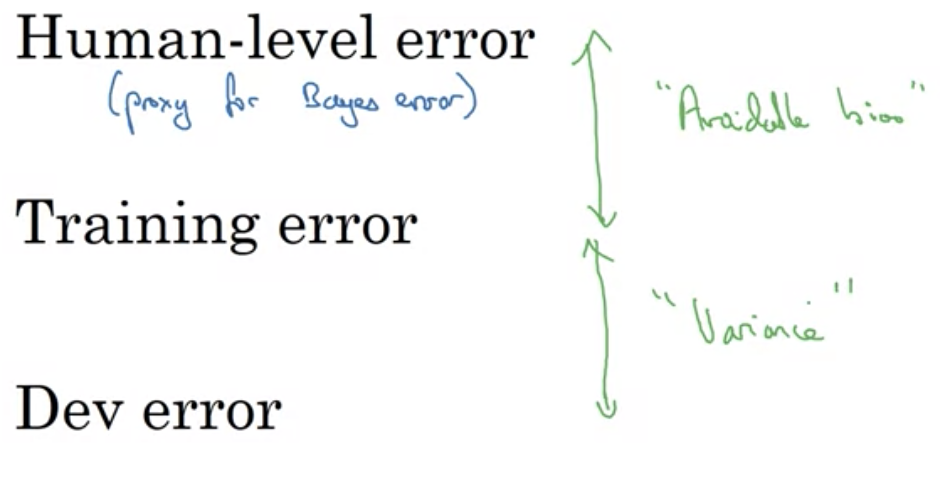

# Orthogonalization

- TV tuning example
  - Multiple knobs to transform image in a specific way
  - Orthoganalization - each knob has one function without affecting others
- Easier to tune
- Chain of assumptions in ML
  - Fit training set well on cost function
  - Fit dev set well on cost function
  - Fit test set well on cost function
  - Performs well in real world
- On each assumption, want a distinct set of knobs to tune
# Single Number Evaluation Metric

- Precision $\rightarrow$ of classified examples, which were classified correctly
- Recall $\rightarrow$ of all images of some class, how many where correctly classified
- Define anew metric that combines P and R
  - F1 score is the harmonic mean $\frac{2}{1/P + 1/R}$
- Well defined dev set + single number evaluation metric allows for deciding which classifier is better

# Satisficing and optimizing metrics

- Example: accuracy and running time
  - Let cost = accuracy - 0.5*running_time
- If we want to maximize accuracy but have running time at a bare minumum, then we **optimize** accuracy and **satisfice** running time
- If there are $N$ metrics, want to optimize 1 and satisfice $N-1$

# Train/Dev/Test Set Distributions

- Dev and test sets should come from same distribution
- Dev set + metric = a target on which to aim (find best classifier)
  - Iterate to the center
- Should not generalize to one distribution over another
  - Choose dev + test set to reflect data expected in feature, important to generalize on
- Randomly shuffle to produce dev + test

# Size of Dev and Test Sets and When to Change

- Size of test set $\rightarrow$ big enough to give high confidence in overall model performance
- Changing metric = changing position of target board
- A metric can indicate well, but algorithm could not perform as intended $\rightarrow$ change metric
- Error in dev set
  - $\mathrm{Err}=\frac{1}{m_\mathrm{dev}}\sum_{i=1}^{m_\mathrm{dev}}\mathcal{I}\{y^{(i)}_\mathrm{pred}\neq y^{(i)}\}$
  - Counts misclassified images
  - Instead, could give greater weight to images that aren't desired but prone to being classified
- Orthogonalization
  - Define metric
  - Worry separately how to do well on metric
- **If doing well on metric + dev set $\neq$ doing well on application, change metric/dev set**

# Human-level performance

- Algorithm stablilizes in accuracy after exceeding human performance $\rightarrow$ theoretical Bayes optimal error
- As long as ML worse than humans
  - Get labeled data from humans
  - Gain insight from manual error analysis
  - Better analysis of bias/variance
# Avoidable bias

- If training and dev error much more than human error, then is a high bias problem
- If human error is similar, focus on variance
- Treat human level error as proxy for Bayes error
- Difference between Bayes (Human) error and training error is **avoidable bias**
- Difference between training and dev error is **variance**

# Understanding human-level performance

- Human error is a proxy for Bayes optimal error
- If training and dev error is very similar, then want a lower human error
  - Allows for adjusting addressing avoidable bias problem which would be otherwise ignored

  

# Surpassing Human-Level Performance

- Given multiple error sources, sometimes can't tell if it is a bias or variance issue
- Cannot rely on intuition to determine what changes to make if model surpasses human error at its lowest
- Surpassing examples
  - Online advertising
  - Product recommendations
  - Logistics
  - Loan approval
- Humans good at natural perception tasks in general

# Improving Model Performance

- Fundamental assumptions of supervised learning
  - Can fit training set well
  - Training set performance generalizes well to dev/test set
- Reducing avoidable bias
  - Bigger model
  - Better/longer optimization algorithms
  - NN architecture/hyperparameter search improvements
- Variance improvements
  - More data
  - Regularization $\rightarrow$ $L_2$, dropout, data aug.
  - Better architecture