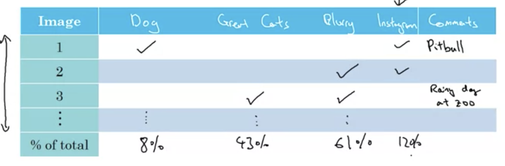

# Error analysis

- Look at mislabeled dev set examples to evaluate ideas
- Ceiling - how much working on a certain problem can help
- Evaluate multiple ideas in parallel
  - Track and classify a small subset of dev set
  - Can find distribution of each label from this subset

  

# Cleaning up Incorrectly Labeled Data

- DL algorithms robust to random errors given training set is large enough
  - Not robust to systematic errors
- Errors to observe
  - Look at overall dev set error
  - Errors due to incorrect labels
  - Errors due to other causes
- Typically focus on error that contributes most to overall
- Dev set purpose - help select between 2 classifiers $A$ and $B$
- Apply same correction process to dev and test sets at trhe same time, need to come from same distribution
- Consider examples algorithm got right **and** wrong, prevent a biased estimate
  - Sometimes unreasonable to do, but helpful
- Train and dev/test data may now come from slightly different distributions
  
# Build First System Quickly, then Iterate

- Quickly set up dev/test set metric
- Build an initial system quickly
- Use bias/variance + error anlaysis to prioritize next steps

# Training and Testing on Different Distributions

- Can combine the 2 different datasets and apply random shuffling
  - Is not as effective when the sizes of sets vary significantly
- Other option - make train set mostly one distribution and dev/test sets all of the minor distribution
  - Disadvantage - train distribution $\neq$ test/dev distribution
  - Gives better performance in the long term
  - Essentially choose best/valuable data of the training set in majority

# Bias and Variance with Mismatched Data Distributions