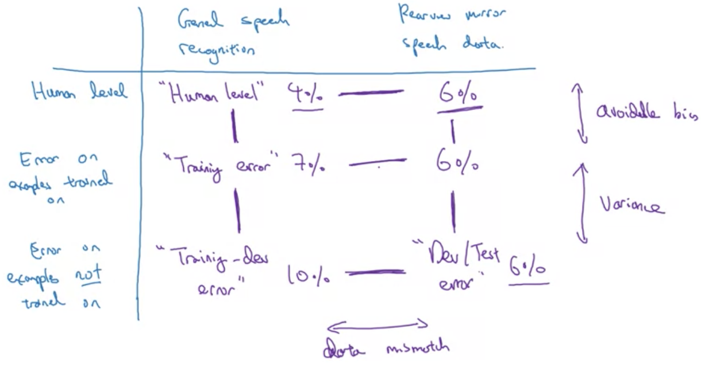

# Error analysis

- Look at mislabeled dev set examples to evaluate ideas
- Ceiling - how much working on a certain problem can help
- Evaluate multiple ideas in parallel
  - Track and classify a small subset of dev set
  - Can find distribution of each label from this subset

  

# Cleaning up Incorrectly Labeled Data

- DL algorithms robust to random errors given training set is large enough
  - Not robust to systematic errors
- Errors to observe
  - Look at overall dev set error
  - Errors due to incorrect labels
  - Errors due to other causes
- Typically focus on error that contributes most to overall
- Dev set purpose - help select between 2 classifiers $A$ and $B$
- Apply same correction process to dev and test sets at trhe same time, need to come from same distribution
- Consider examples algorithm got right **and** wrong, prevent a biased estimate
  - Sometimes unreasonable to do, but helpful
- Train and dev/test data may now come from slightly different distributions
  
# Build First System Quickly, then Iterate

- Quickly set up dev/test set metric
- Build an initial system quickly
- Use bias/variance + error anlaysis to prioritize next steps

# Training and Testing on Different Distributions

- Can combine the 2 different datasets and apply random shuffling
  - Is not as effective when the sizes of sets vary significantly
- Other option - make train set mostly one distribution and dev/test sets all of the minor distribution
  - Disadvantage - train distribution $\neq$ test/dev distribution
  - Gives better performance in the long term
  - Essentially choose best/valuable data of the training set in majority

# Bias and Variance with Mismatched Data Distributions

- Example: human cat classification has near 0% error
- Define a new data subset $\rightarrow$ same distribution as training set but not used for training
  - Randomly shuffle dataset and select a section
  - Do not train model on this
- Data mismatch problem $\rightarrow$ data does well on undesired distribution

  

# Addressing Data Mismatch

- Manual error analysis, can figure out cause of difference between training and dev/test sets
- Make training data more similar, or collect data similar to dev/test sets
- Artificial data synthesis
  - E.g. superposition of audio effects
  - Artificial car images

# Transfer learning

- Apply learning from one task to another
- Example
  - Train model on image recognition task
  - Swap in new dataset $(x,y)$ with the diagnoses
  - Initialize last layer weights
  - Possibly retrain last few layers
- If retrain entire network with updates based on new data
  - **Pre-training** is done on the network using old weights for initialization
- Transfer learning is useful in applying model from task $A$ to task $B$ which lacks enough training data

# Multi-task learning

- If there are $n$ classes, each training example will be a $n\times 1$ vector with multiple "hot" classes ($\mathbb{R}^n$)
- Network would output $n\times 1$ vector with each entry representing a class
- Loss would be $\frac{1}{m}\sum_{i=1}^n\sum_{j=1}^4\mathcal{L}(\hat{y}_j^{(i)},y_j^{i})$
- Is not softmax regression $\rightarrow$ each image can have multiple labels
- Multi-task learning because network is solving $n$ problems
  - Does each image have each of these $n$ classification features
- Used when training on set of tasks that benefit from sharing low-level features (e.g. contours, dots)
- Amount of data for each task available is similar
- Can train if big network architecture is feasible

# End-to-end deep learning

- Multistep approach to complete multiple steps in, for example, image recognition
  - Breaking problem down into multiple approaches is a better approach
- Can build networks to perform individual tasks in a project pipeline
- End to end approach does not work best in modern practice

# When to use end-to-end approach

- Pros
  - Lets the data speak $\rightarrow$ appropriate mapping $x\rightarrow y$ emerges, and human preconceptions will not be present
  - Less hand-designing of components needed
- Cons
  - May need large amounts of data $\rightarrow$ need to learn from one input end to another
  - Excludes potentially useful hand-designed components
    - Two components: data and what is hand-designed
- Application of end-to-end
  - Is there sufficient data to learn a complex mapping $x\to y$