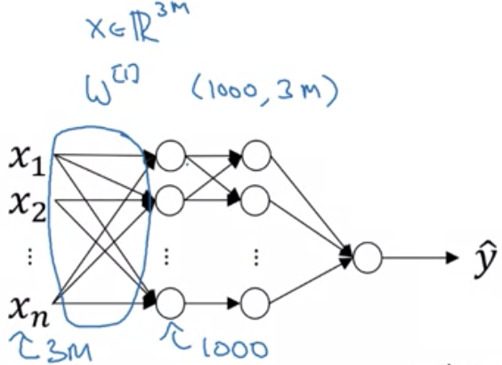
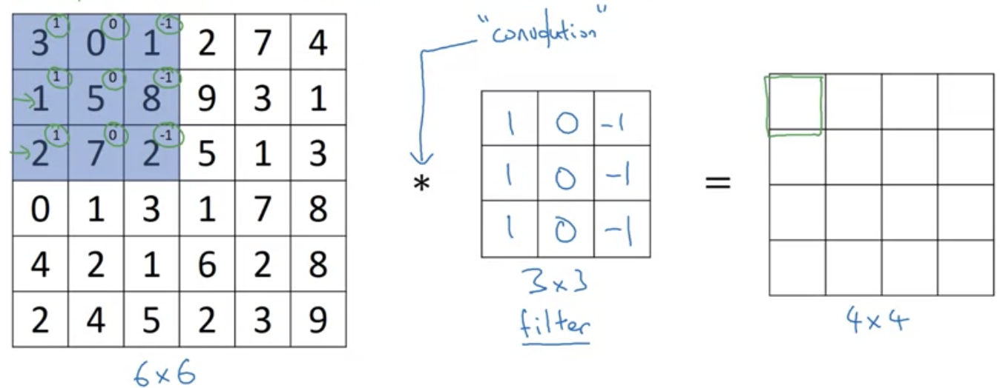
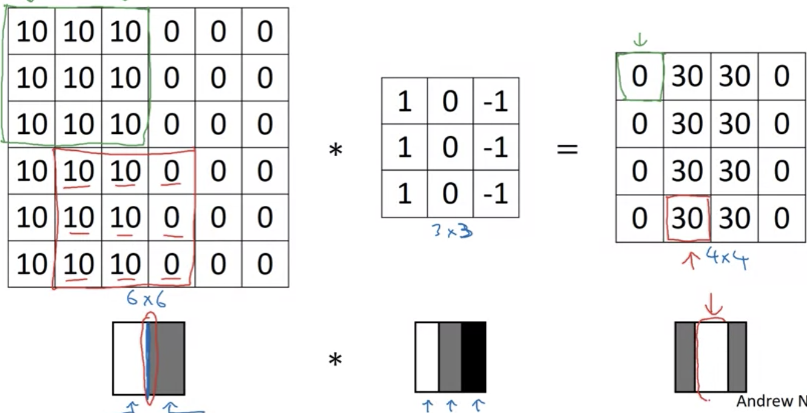
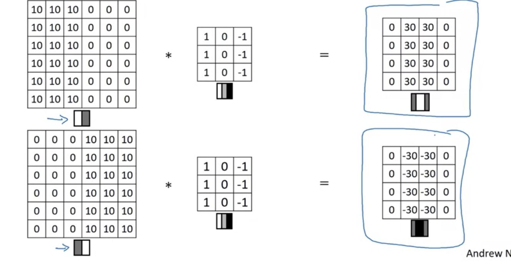

# Computer Vision

- Image classification
  - Binary classification
- Object detection
  - Drawing boxes/bounding the objects
  - Multiple instances of object
- Neural Style Transfer
  - Content and style images
  - Repaint content w/ style
- Inputs can get large
  - E.g 64x64x3 is small but larger images have many input features

  

- If $x\in \mathbb{R}^{3M}$ then $W^{[1]}\rightarrow (1000,3M)$
  - $W^{[1]}x$ gives the output network vector of dimension $(1000,1)$
- Implementing the convolution operation is efficient for large input images

# Edge Detection

- Detecting certain festure sets of images
  - E.g. vertical and horizontal edges
- Given a 6x6 grayscale image, apply a 3x3 kernel or filter
  - **Convolution operator** $*$ convolves filter over image
- Paste filter on the first such region of the image, and take elementwise product and then sum to obtain value
- Output a 4x4 image

  

- Shift the kernel stepwise to the left to fill up the output
- Is 4x4 as can shift downwards/left/right to obtain 4 unique locations
  - $\mathrm{dim}(\mathrm{Im},1)-\mathrm{dim}(\mathrm{Ker},1)+1$

  

- In example, detects a light to dark transition
- Can also make distinction

  

- *Example*: Sobel filter $\rightarrow$ puts weight towards central pixel, more robust for edge detection
- Rotate 90 degrees for horizontal/vertical differentiation
- Can learn the filter values with backprop
  - Treat as parameters, learn

# Padding

- Given an image with input dimensions $n\times n$ and filter with $f\times f$
  - Output dimensions are $n-f+1\times n-f+1$
- Downsides $\rightarrow$ image shrinks
  - Lots of overlap on central pixels but corner pixels represented less
- Can pad image with border of 1px, for example
  - 6x6 $\rightarrow$ 8x8 image
- Can preserve dimension of output image
  - Padding pixels are 0 by convention
  - Let $p=1$ be padding amount
- Valid and Same convolutions
  - Valid $\rightarrow$ no padding
    - $n\times n\;\ast\;f\times f\rightarrow n-f+1\times n-f+1$
  - Same $\rightarrow$ pad s.t. output size = input size
- By convention, $f$ is always odd, i.e $f\mod 2\neq 0$