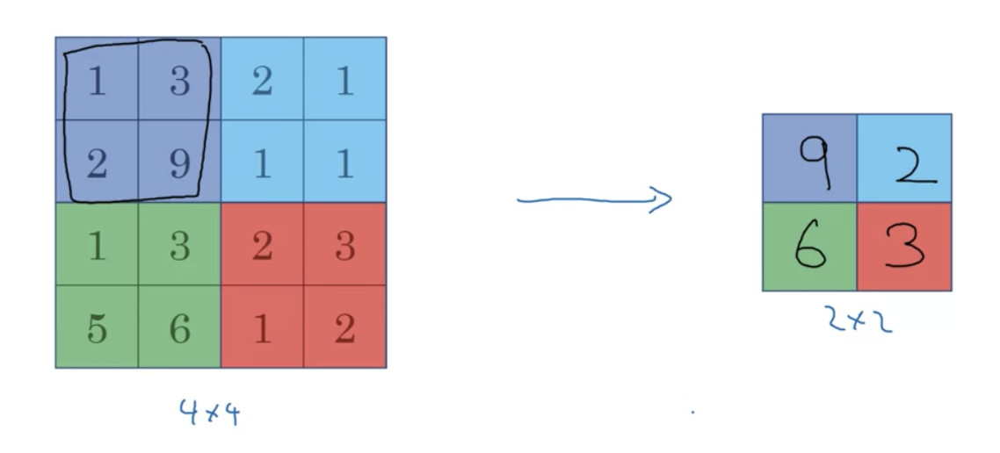

# Computer Vision

- Image classification
  - Binary classification
- Object detection
  - Drawing boxes/bounding the objects
  - Multiple instances of object
- Neural Style Transfer
  - Content and style images
  - Repaint content w/ style
- Inputs can get large
  - E.g 64x64x3 is small but larger images have many input features

  

- If $x\in \mathbb{R}^{3M}$ then $W^{[1]}\rightarrow (1000,3M)$
  - $W^{[1]}x$ gives the output network vector of dimension $(1000,1)$
- Implementing the convolution operation is efficient for large input images

# Edge Detection

- Detecting certain festure sets of images
  - E.g. vertical and horizontal edges
- Given a 6x6 grayscale image, apply a 3x3 kernel or filter
  - **Convolution operator** $*$ convolves filter over image
- Paste filter on the first such region of the image, and take elementwise product and then sum to obtain value
- Output a 4x4 image

  

- Shift the kernel stepwise to the left to fill up the output
- Is 4x4 as can shift downwards/left/right to obtain 4 unique locations
  - $\mathrm{dim}(\mathrm{Im},1)-\mathrm{dim}(\mathrm{Ker},1)+1$

  

- In example, detects a light to dark transition
- Can also make distinction

  

- *Example*: Sobel filter $\rightarrow$ puts weight towards central pixel, more robust for edge detection
- Rotate 90 degrees for horizontal/vertical differentiation
- Can learn the filter values with backprop
  - Treat as parameters, learn

# Padding

- Given an image with input dimensions $n\times n$ and filter with $f\times f$
  - Output dimensions are $n-f+1\times n-f+1$
- Downsides $\rightarrow$ image shrinks
  - Lots of overlap on central pixels but corner pixels represented less
- Can pad image with border of 1px, for example
  - 6x6 $\rightarrow$ 8x8 image
- Can preserve dimension of output image
  - Padding pixels are 0 by convention
  - Let $p=1$ be padding amount
- Valid and Same convolutions
  - Valid $\rightarrow$ no padding
    - $n\times n\;\ast\;f\times f\rightarrow n-f+1\times n-f+1$
  - Same $\rightarrow$ pad s.t. output size = input size
- By convention, $f$ is always odd, i.e $f\mod 2\neq 0$

# Strided Convolutions

- Stride of $s$ means moving kernel by $s$ steps instead of default 1
- Output dimensions become following where $p$ is the padding amount and $s$ is the stride

$$\left\lfloor\frac{n+2p-f}{s}+1\right\rfloor\times \left\lfloor\frac{n+2p-f}{s}+1\right\rfloor$$

- Floor because do not want kernel being outside of the image or padding region
- A preprocessing step on convolution in mathematics
  - Flip the kernel vertically then horizontally (mirroring)
- Use flipped kernel for convolution $\rightarrow$ cross-correlation
  - Not required in NNs
- Convolution obeys property of being associative but not commutative
  - $(A*B)*C=A*(B*C)$

# Convolutions over volume

- In RGB image, a $6\times 6 $ image represented as $6\times 6\times 3$ stack
- Filter also contains 3 layers (R,G,B) of size $3\times3\times 3$
- Number of channels in image and filter must match
- Convolution computation: Add all 3 individual layer convolutions

  

- Multiple features at the same time
  - E.g. horizontal and vertical edge detection filters
  - Take individual outputs and stack $\rightarrow$ $n\times n\times 2$ filters if stacking 2
- Thus the stacked multi-feature output is of dimension $n-f+1\times n-f+1\times n_c$ where $n_c$ is the number of convolutional features

# Building layer of convolutional network

- For the output of each filter, apply bias ($\mathbb{R}$) then ReLU
- Then the layers are stacked

  

- Thus we are taking $a^{[0]}\in (6,6,3)\rightarrow a^{[1]}\in (4,4,2)$ for example
- Number of parameters in a layer
  - E.g. a $3\times3\times 3$ filter with 10 filters being applied would have 27 + 1 (bias) = 28 total parameters for one filter, thus 280 overall.
- Number of parameters remains constant regardless of size of image $\rightarrow$ useful property that prevents overfitting
- If layer $l$ is a convolutional layer
  - $f^{[l]}$ = filter size
  - $p^{[l]}$ = padding
  - $s^{[l]}$ = stride
- The input to this layer is $n_h^{[l-1]}\times n_w^{[l-1]}\times n_c ^{[l-1]}$
- The output volume is

$$
n_{\{h,w\}}^{[l-1]}=\left\lfloor \frac{n_{\{h,w\}}^{[l-1]}+2p^{[l]}-f^{[l]}}{s} + 1 \right\rfloor
$$

- Size of each filter is $f^{[l]}\times f^{[l]}\times n_c^{[l-1]}$ because the number of channels must match that of input
- Size of activations (output layer) are $a^{[l]}\rightarrow n_h^{[l]}\times n_w^{[l]}\times n_c^{[l]}$
  - If using batch GD $\rightarrow$ $A^{[l]}\rightarrow m\times n_h^{[l]}\times n_w^{[l]}\times n_c^{[l]}$ where $m$ is number of training examples in the batch
- Bias will have $n_c^{[l]}$ variables, or $(1,1,1,n_c^{[l]})$
- At the end of the convolutional layers, can flatten the final result and feed into a logistic or softmax to obtain the result
- Types of layers in conv net $\rightarrow$ convolution (conv), pooling (pool), fully connected (FC)

# Pooling layers

- Reduce size of representation to speed up computation
- A max pooling layer breaks the layer into regions $\rightarrow$ use the max of each corresponding region

  

- Hyperparameters of max pooling
  - $f=2, s=2$ for the **filter size and stride**
- Output size of max pooling is $\left\lfloor \frac{n+2p-f}{s}+1 \right\rfloor$
- On 3D input, the output of max pooling has the same 3rd dimension
  - Pool on each channel independently
- Average pooling is similar, takes the average of each region
- Max pooling is more widely used
- Do not use padding with max pooling $\rightarrow$ $p=0$